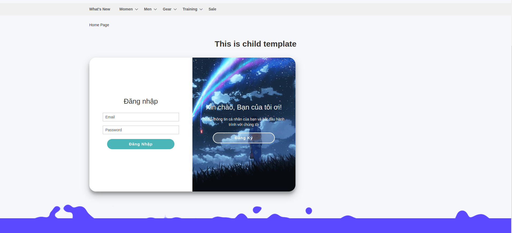
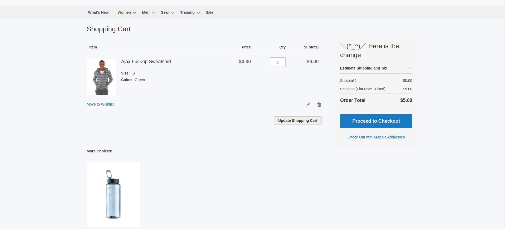
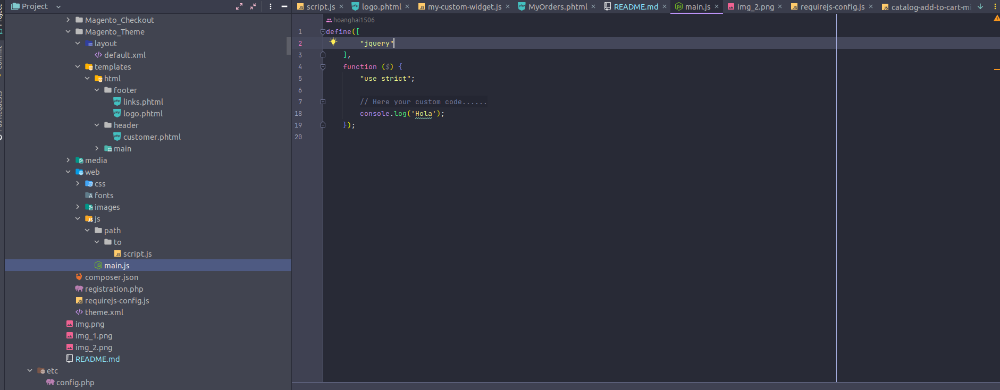
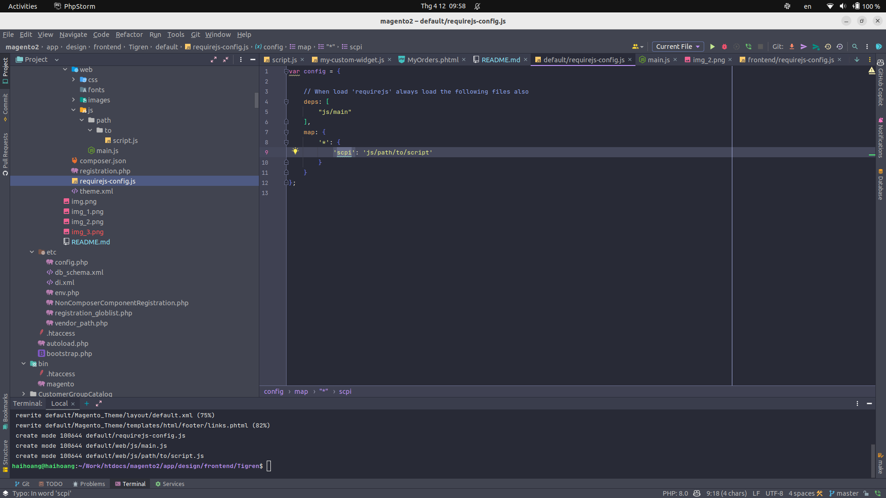
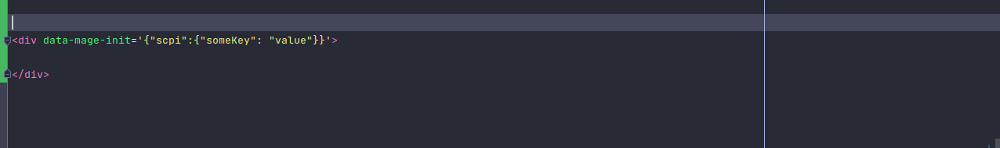
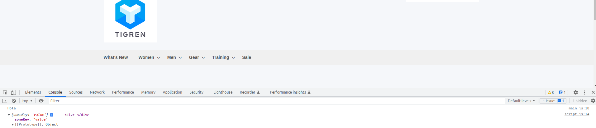
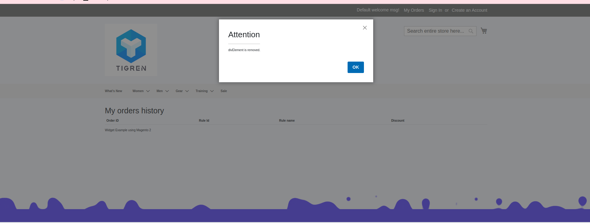
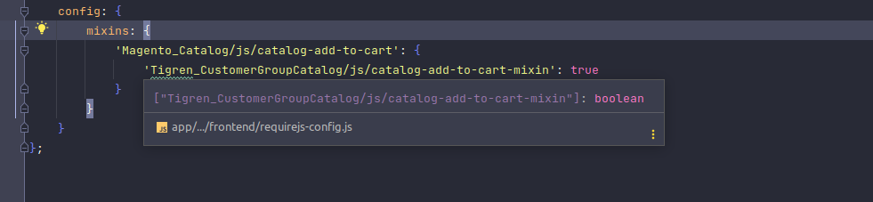

# Theme Tigren Default
## Challenge 1: Add a container to the footer on all pages

## Challenge 2: Add a child block to one of your previously created blocks and output further content from another template

## Challenge 3: Override layout file from a theme

# Code Challenge JS
## Challenge 1: 

## Challenge 2:
Add a template via layout and use data-mage-init /
x-magento-init to include a simple JS file that logs or alerts
data

## Challenge 3:
Create a jQuery widget to perform a simple interaction on
the page

Create a mixin for your widget to modify it’s functionality

